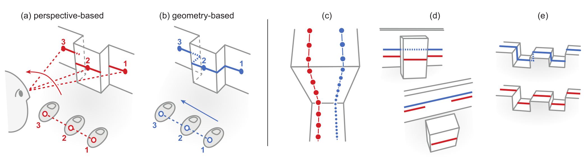
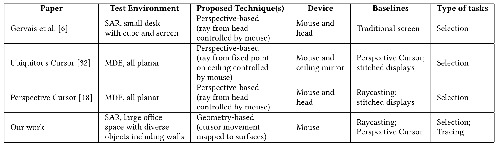
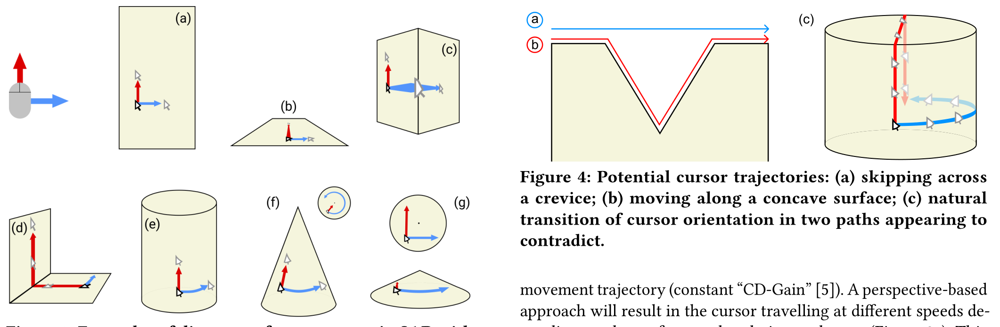
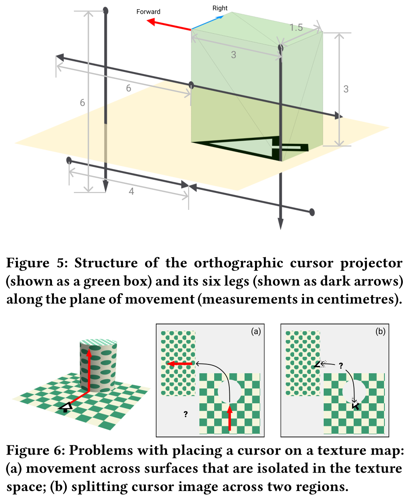
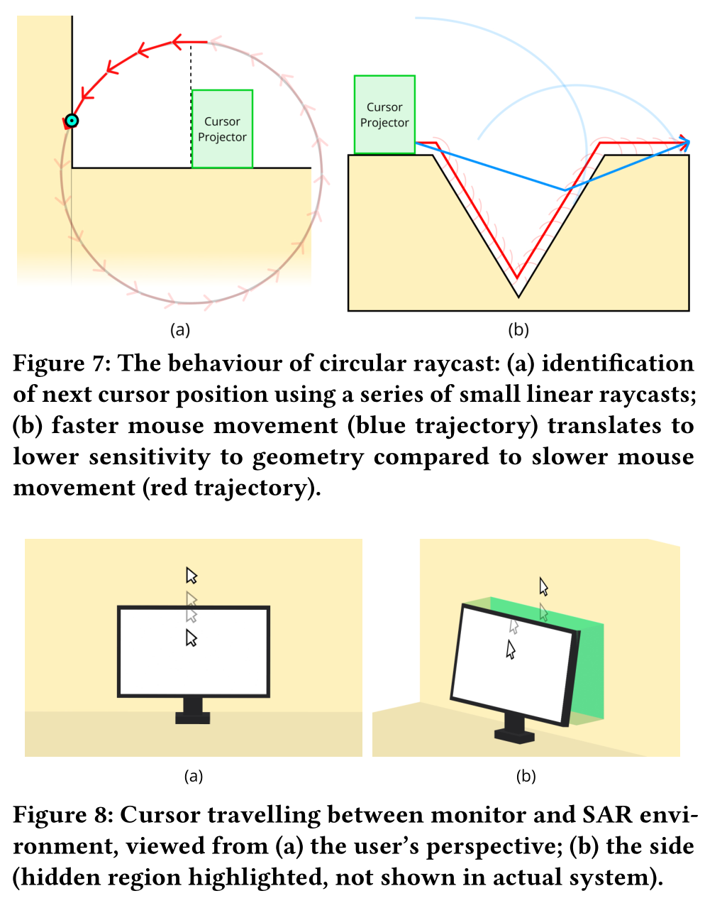
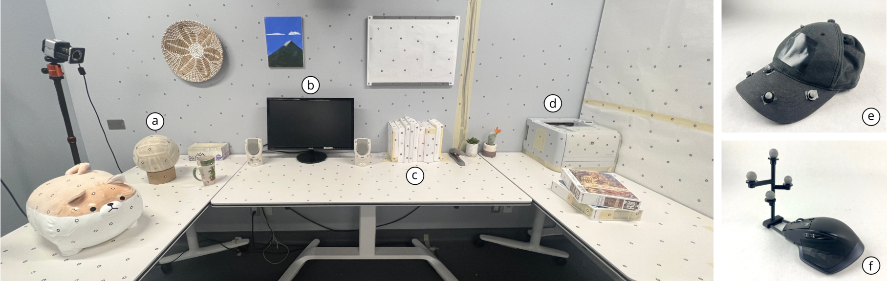
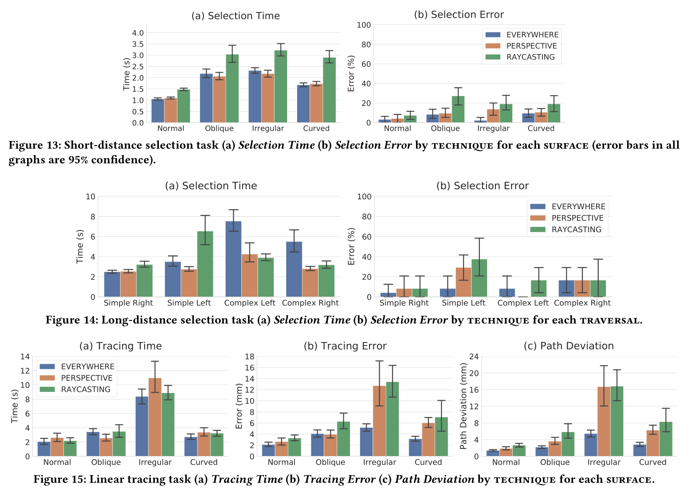
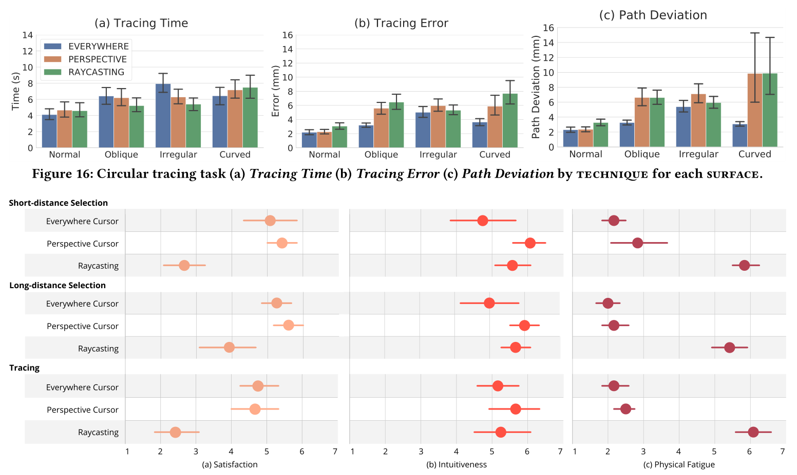
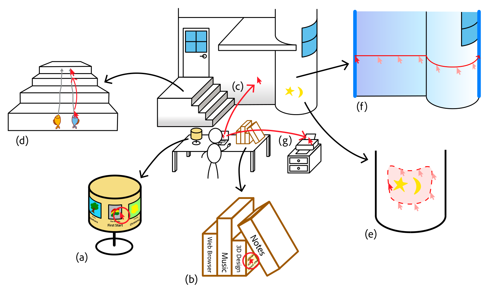

# 文献阅读

*Perspective and Geometry Approaches to 
Mouse Cursor Control in Spatial Augmented Reality*  

2023.11

---

## Outline

- 发现问题
  - 什么是SAR
  - 如何控制SAR空间——问题域
- 相关工作
- 解决的方法
  - 基于透视关系
  - 基于几何关系
  - 论文需要解决的挑战
- 评估实验
- 结论
---

## 发现问题
什么是SAR？

将PC扩展到非桌面（屏幕）显示环境
> "Spatial Augmented Reality (SAR) is a method to render digital con-
tent directly onto surfaces in a real physical 3D environment, typi-
cally using projection mapping [ 24 , 25 ]. It can cover surfaces and
objects with illusionary textures and virtual 3D objects, enabling
applications like gaming and teleportation (e.g., [ 11 , 20 ]). But SAR
can also be used in a more subtle and integrated way, to selectively
augment real surfaces and objects with 2D “surface-mapped” digi-
tal information [ 8 ]. Essentially, every surface becomes a potential
computer display without the need for special AR glasses."

---

## 发现问题
如何与SAR空间交互？——进一步限定问题域

- 直接接触
>  "Direct touch would only be reasonable for nearby targets and can be less precise"
- 手部追踪/3D控制器
> "Mid-air raycasting using hand tracking or 3D controllers has issues like tremors, low input precision on distant targets, and 3D surface occlusion"
- 普通鼠标
> “大多数使用者熟悉”、“使桌面电脑和SAR融为一体”
---

## 发现问题
问题域为：在SAR空间与交互领域的鼠标操作控制
- 不需要AR/VR眼镜
- 鼠标光标必须渲染到现有的集合环境上
> "We frst provide an overview of work that motivates the expan-
sion of desktops to SAR as a pervasive computing platform. Then,
we describe relevant mouse techniques for SAR and multi-display
environments that can enable mouse interaction on real physical
surfaces. While mouse techniques for VR exist (e.g., [ 3 , 33 ]), we limit our investigation to non-VR techniques where the cursor must
be rendered on existing environment geometry."
---

## 相关工作

> 该图片对比两种解决方法，该对比在后续还会深入探讨 

作者简单介绍了问题域内工作的不足：
- 只能在平面上投影，桌面和墙壁
- 由于投影是点出发，手部的微小抖动会被放大
- 同理，在深度不同的表面，光标的速度会变化

---

## 相关工作

还介绍了最相关工作

- [32]  通过以天花板为中心的半球点进行光线投射来找到光标的位置
- [18] 使用光线投射将光标沿着以用户头部为中心的虚拟球体移动

---

## 解决的方法
  - 基于透视关系
  - 基于几何关系

由此作者开始正式介绍两种解决方法

---

## 基于透视关系的光标移动
定义：

- 天花板与用户头部

> "With a perspective-based approach, mouse movement is mapped to the azimuth (horizontal) and zenith (vertical) angles of a ray cast from an origin point in the environment. The intersection of this ray with the nearest display surface determines the cursor position. "

优势：
- 用户为中心，使光标保持在视野中，并简化了光标在复杂曲面几何上的移动。

不足：
- 透视效应导致的精确度问题，见P6

> tips: 按照行文顺序，作者下文给出两种方法所面临的挑战

---

## 论文需要面对的挑战

- 鼠标移动方向和光标移动方向
- 稳定的移动速度和轨迹
- 裂缝空隙等的交互细节
- 复杂图形的遮挡

---
## 基于几何的光标移动技术

实现方法：3D建模

> "For cursor visualization, we use a small virtual orthogonal projector,
called the cursor projector, that foats throughout the 3D model of
the environment. It renders a cursor 1.5cm in width and 3cm in
height when cast perpendicular to the surface (Figure 5). "

相比纹理贴图，解决了相邻表面的渲染问题

---
## 基于几何的光标移动技术

解决前文问题

- 不规则曲面
> "We employ a set of six short raycasts around the cursor, referred to as legs, to sample nearby surface normals and orient the cursor projector to the surrounding local geometry (Figure 5). "
- 光标移动方向问题：检测水平/垂直，替换前进/向上的向量。以下是如何区别水平/垂直
> "We defne the cursor surface ashorizontal if the angle between and the global up-vector is less than 45°, and vertical if otherwise. "

---
## 基于几何的光标移动技术

解决前文问题

- 平滑光标轨迹：使用“圆形光线投射”来确定光标移动，将光标的 X Y 坐标映射到光标投影仪沿着其局部的向量。
> "Then, it aligns the circular raycast along the direction of movement, with a radius equal to mouse movement distance as determined by system pointer acceleration and CD gain (Figure 7a)."

- 显示器和环境的过渡：特殊情况处理

- 重置光标位置功能

---
## 评估实验设计

- 参与者、环境、设备
- 改进基于透视的实现：头部与鼠标移动向量映射
- 光线投射方法
---
## 评估实验设计
实验流程

- 短距离测试和长距离测试
- 基于几何、基于透视、光线投射
- 不同的平面和光标任务，如画圆等
> "In summary: 3 techniqes × 4 surfaces × 3 blocks × 4 target pairs = 144 data points per participant for Stage 1, and 3 techniqes × 4 surfaces × 3 blocks × 2 tracings = 72 data points perparticipants for Stage 2."

---
## 评估实验设计

测量指标

- 选择任务：时间、点偏差
- 轨迹任务：轨迹时间、轨迹错误、路线偏差
- 主观指标：满意度、直觉符合度、疲惫度

以下是定义：
> "Selection Time is defned as the duration starting at the moment the start target is clicked until a click-down event. Selection Error is the proportion of trials with errors, reported as an error rate. Tracing Time is the duration from crossing the start gate to the end gate. Tracing Error is a measure of accuracy calculated as the average distance orthogonal to the tracing path (for linear) or radial distance (for circular) away from the ideal path, as per its defnition by Cami et al. [ 4 ]. Path Deviation is the standard deviation of the cursor distance orthogonal to the tracing path (for linear) or its radial distance from the origin (forcircular)."
---
## 实验结果

---
## 实验结果

---
## 结论
场景构想

---
## 结论
- 基于几何光标技术精确度和速度优于基于透视技术。
- 基于透视技术在复杂遮挡是速度更优。
- 基于几何光标技术包含直接光线投射，有高错误率和疲劳，不适合频繁使用。 相比之下，透视光标在高速、长距离移动时提供了强大的性能，并且使用起来相对舒适，因为用户不需要举起鼠标。
---
## References

- [论文地址](https://dl.acm.org/doi/pdf/10.1145/3544548.3580849)

---
# THANK YOU